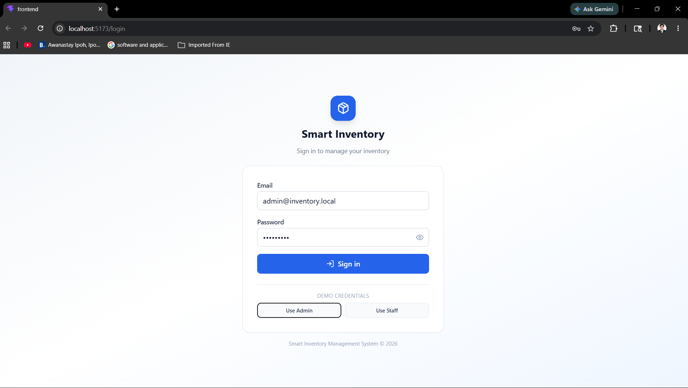
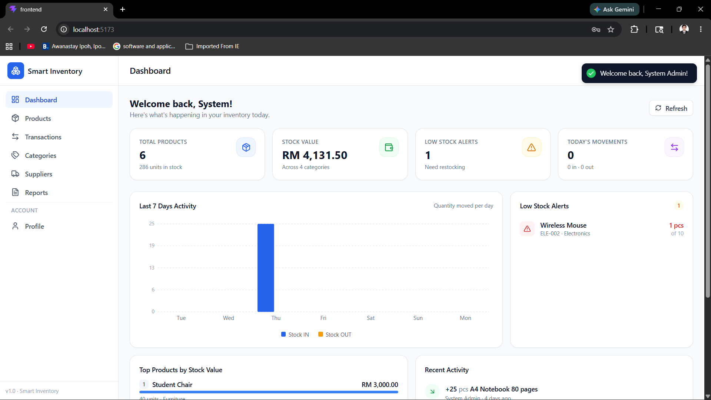
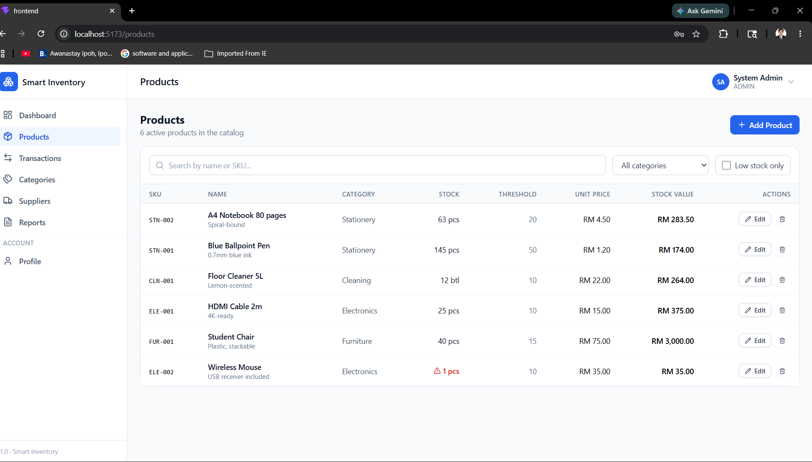
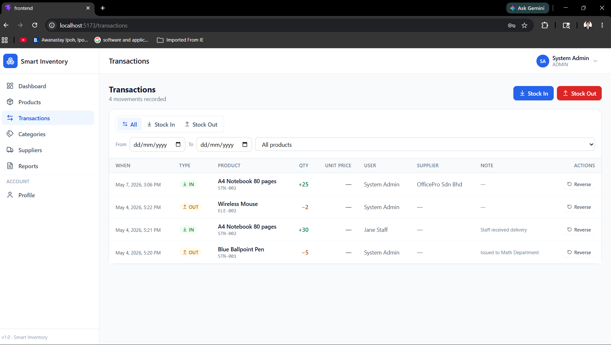
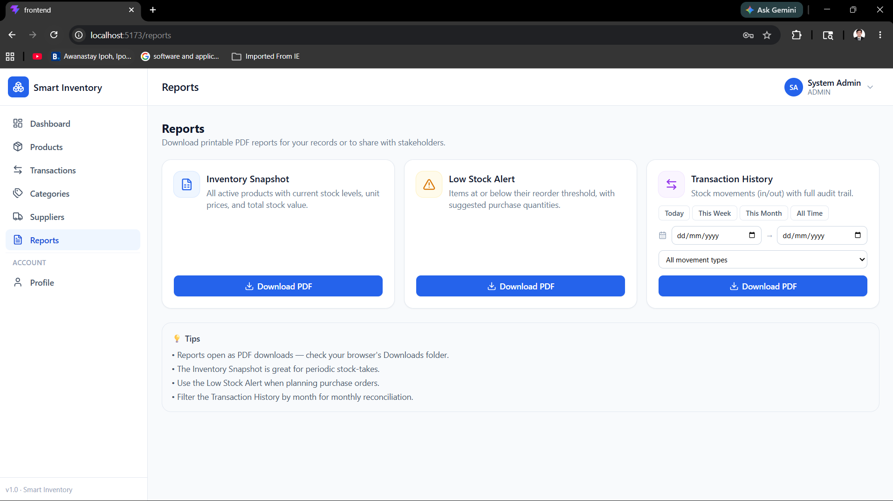
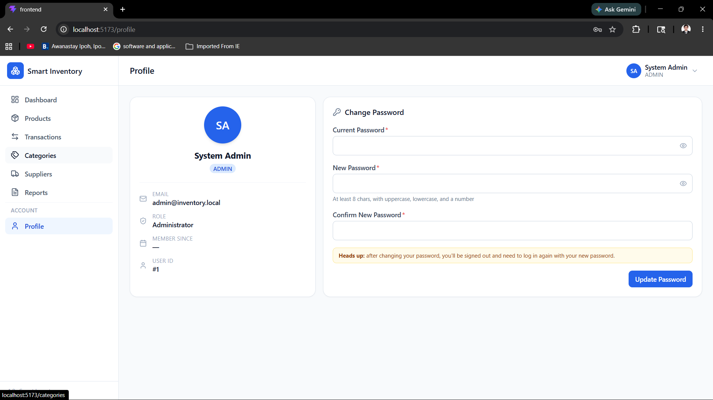

# 📦 Smart Inventory Management System

A modern, production-quality inventory management web application designed for schools and small businesses. Built with React, Node.js, Express, and MySQL.

---

## ✨ Features

- 🔐 **Secure authentication** — JWT-based login with bcrypt password hashing
- 👥 **Role-based access** — Admin and Staff roles with granular permissions
- 📊 **Dashboard analytics** — Real-time stats, 7-day activity chart, low-stock alerts, top products
- 📦 **Full product management** — CRUD with search, category filters, pagination, soft deletes, and admin ability to view and restore deactivated products
- 📥 **Bulk CSV import** — Paste CSV text to create many products at once, with a per-row success/failure report
- 🔍 **Product detail page** — Per-product info, stock-movement stats, and full transaction history
- 🔄 **Stock movement tracking** — Atomic stock-in/stock-out with row-level locking (no race conditions)
- ⚠️ **Low-stock alerts** — Per-product thresholds with reorder suggestions, plus a Navbar bell visible from anywhere in the app
- 📋 **Transaction history** — Complete audit trail with date/type/supplier filters and reversal capability
- 🧾 **Transaction detail page** — Full receipt-style view of a single stock movement, linked from the product involved
- 📄 **PDF & CSV report exports** — Inventory snapshot, low-stock alerts, transaction history with date ranges, supplier roster, and user roster
- 🏷️ **Categories management** — Organize products with friendly product counts, and a category detail page listing everything filed under it
- 🚚 **Suppliers management** — Track contacts, click-to-call/email links, and a supplier detail page with full transaction history
- 👤 **User profile** — Account info, password change with strength meter, reachable from the navbar dropdown
- 🧑‍💼 **User management** — Admin-only account creation, role assignment, activate/deactivate, and password reset
- 🪪 **User detail page** — Account info, recent activity preview, and admin actions in one place
- 🕵️ **Audit logs** — Admin-only trail of logins, password changes, product edits, and stock movements, filterable by user with a direct link from the Users page, exportable as PDF or CSV; entity references link straight to the record's detail page
- 📱 **Fully responsive** — Works beautifully on mobile, tablet, and desktop

---

## 🖼️ Screenshots

> 

---

## 🛠️ Tech Stack

### Frontend
- **React 19** — UI library
- **Vite 6** — Build tool with hot module reload
- **React Router** — Client-side routing
- **Axios** — HTTP client with interceptors
- **Tailwind CSS** — Utility-first styling
- **Lucide Icons** — Beautiful icon set
- **React Hot Toast** — Toast notifications

### Backend
- **Node.js + Express** — Server framework
- **MySQL 8** — Relational database
- **mysql2** — Promise-based MySQL driver with prepared statements
- **JWT (jsonwebtoken)** — Stateless authentication
- **bcryptjs** — Password hashing
- **express-validator** — Request validation
- **PDFKit** — PDF generation streamed without disk writes
- **dotenv** — Environment variable management

---

## 🏗️ Architecture

┌─────────────────┐       ┌──────────────────┐       ┌─────────────┐
│  React Frontend │ HTTP  │  Express Backend │  SQL  │   MySQL DB  │
│  (Tailwind CSS) │ ────▶ │  (JWT Auth)      │ ────▶ │             │
└─────────────────┘       └──────────────────┘       └─────────────┘
Port 5173                  Port 5000                Port 3306

The frontend communicates with the backend via REST APIs. The backend uses a connection pool for MySQL and atomic transactions for all stock movements to ensure data integrity even under concurrent load.

---

## 🚀 Deploying (Free Tier)

This stack deploys entirely on free tiers — no credit card required anywhere.

| Layer | Provider | Why |
|---|---|---|
| Database | [Aiven](https://aiven.io/free-mysql-database) | Always-free managed MySQL (1GB), no expiry |
| Backend | [Render](https://render.com) | Free Node web service (spins down when idle, ~30-60s cold start) |
| Frontend | [Vercel](https://vercel.com) | Free static hosting, auto-detects Vite |

### 1. Database (Aiven)
1. Sign up at Aiven, create a free MySQL service.
2. Once it's running, grab the connection details (host, port, user, password, database name — Aiven's default DB is usually `defaultdb`).
3. Connect with the CLI (or Aiven's web console) and run `backend/database/schema.sql` then `backend/database/seed.sql` against it.

### 2. Backend (Render)
1. Push this repo to GitHub, then create a new **Blueprint** on Render pointing at it — it'll pick up `render.yaml` at the repo root automatically.
2. Fill in the env vars marked `sync: false` in `render.yaml` (`DB_HOST`, `DB_USER`, `DB_PASSWORD`, `DB_NAME` from Aiven, and `CLIENT_URL` — leave a placeholder for now, you'll update it once the frontend is deployed).
3. Deploy. Render generates a URL like `https://smart-inventory-backend.onrender.com`.

### 3. Frontend (Vercel)
1. Import the repo into Vercel, set the project root to `frontend/`.
2. Add an env var `VITE_API_BASE_URL` = `https://<your-render-url>/api`.
3. Deploy. Vercel generates a URL like `https://smart-inventory.vercel.app`.

### 4. Close the loop
Go back to Render and update `CLIENT_URL` to your Vercel URL (comma-separate multiple origins if needed, e.g. for a custom domain too), then redeploy the backend.

---

## 📁 Project Structure

smart-inventory/
├── backend/
│   ├── database/
│   │   ├── schema.sql           # Database schema
│   │   └── seed.sql             # Sample data
│   └── src/
│       ├── config/              # DB & env loading
│       ├── controllers/         # Business logic
│       ├── middleware/          # Auth, validation, errors
│       ├── models/              # DB queries (parameterized)
│       ├── routes/              # API endpoints
│       ├── utils/               # JWT, bcrypt, PDF helpers
│       ├── app.js               # Express setup
│       └── server.js            # Server entry point
└── frontend/
└── src/
├── api/                 # Axios instance + per-resource APIs
├── components/
│   ├── common/          # Reusable UI (Button, Modal, etc.)
│   ├── layout/          # Sidebar, Navbar, DashboardLayout
│   ├── dashboard/       # Dashboard widgets
│   ├── products/        # Product table, filters, form
│   ├── transactions/    # Transaction-specific
│   ├── categories/      # Category form modal
│   ├── suppliers/       # Supplier form modal
│   └── reports/         # Report cards
├── context/             # AuthContext
├── hooks/               # useAuth, useDebounce
├── pages/               # One file per page
├── routes/              # Route table + PrivateRoute
└── utils/               # Formatters
